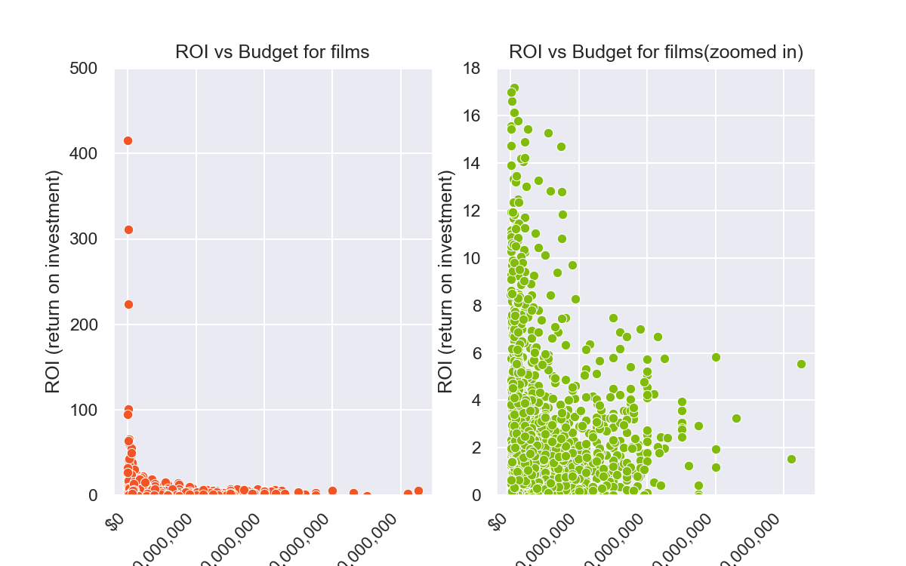

# Microsoft Movie Analysis

**Authors**: Moses Kuria

## Overview

Microsoft sees all the big companies creating original video content and they want to get in on the fun. They have decided to create a new movie studio, but they don’t know anything about creating movies. You are charged with exploring what types of films are currently doing the best at the box office. You must then translate those findings into actionable insights that the head of Microsoft's new movie studio can use to help decide what type of films to create.

## Business Problem

The basis of the business problem is Microsoft trying to break into a market that is new to them. Their expertise is in Software products. The task is, therefore, to breakdown the market as a whole. What types of movies are made? What did it cost to make them? How much did they gross? What were their ratings? All of these are beneficial to a new player in an industry to have domain-specific knowledge and to focus their efforts on key areas.

## Data

The Datasets used came from IMDB and The Numbers. 
The data from IMDB contained movies with their titles, ratings, number of votes, genres and so on.
The data from The Numbers contained movie titles and financials all of the financials utilized in this dataset for analysis


## Methods

Before I could utilize the variables aforementioned, the data had to undergo a process of preparation to ensure that the insights I would generate would be as accurate as possible. This included:
* Dropping rows with empty values
* Removing any duplicated rows
* Making sure the data is in the correct format
* Creating variables necessary for analysis
* Dropping variables not needed in analysis

## Results




## Conclusions

Based on my analysis, this would be my recommendations to Microsoft:

Microsoft studios should focus on making Dramas, Comedies, Action, Adventure and Thrillers in the beginning of their production.
Microsoft studios should aim to release their movies in June, May and September if they want to optimize their revenue
Microsoft studios should manage their movie production budgets as higher investments do not necessarily lead to higher profits.
More analysis is needed to understand why movie releases have been less over the years since 2014 as well as to establish the Genres with the highest revenues.

Some points to note would be that in the averagerating, some movies had more votes than others that went into the determination of the rating. This leads to some innate bias in the rating bias. For example, 1,841,066 people voted for Inception while only 5 people voted for The Lambirds.Inception has an 8.8 averagerating while The Lambirds has a 9.2 averagerating. This has some influence on the final rating as this is the averagerating, determined by the number of people voting and their overall votes.

The gross data also contains a significant number of zeros that I chose to keep in the dataset. I found that there might be movies, however unrealistic, that did not generate any revenue. This could be due to a number of factors like inability to strike a deal with the companies owning cinemas, streaming services and so on. More investigation is needed to determine if this is the case. However, until then, I opt to keep them in my analysis.


## For More Information

Please review our full analysis in [our Jupyter Notebook](./Microsoft Movie Analysis.ipynb) or our [presentation](./Microsoft Movie Analysis Presentation.pdf).

For any additional questions, please contact **Moses Kuria & moses.kuria@student.moringaschool.com*

## Repository Structure

Describe the structure of your repository and its contents, for example:

```
├── README.md                           <- The top-level README for reviewers of this project
├── dsc-phase1-project-template.ipynb   <- Narrative documentation of analysis in Jupyter notebook
├── DS_Project_Presentation.pdf         <- PDF version of project presentation
├── data                                <- Both sourced externally and generated from code
└── images                              <- Both sourced externally and generated from code
```
